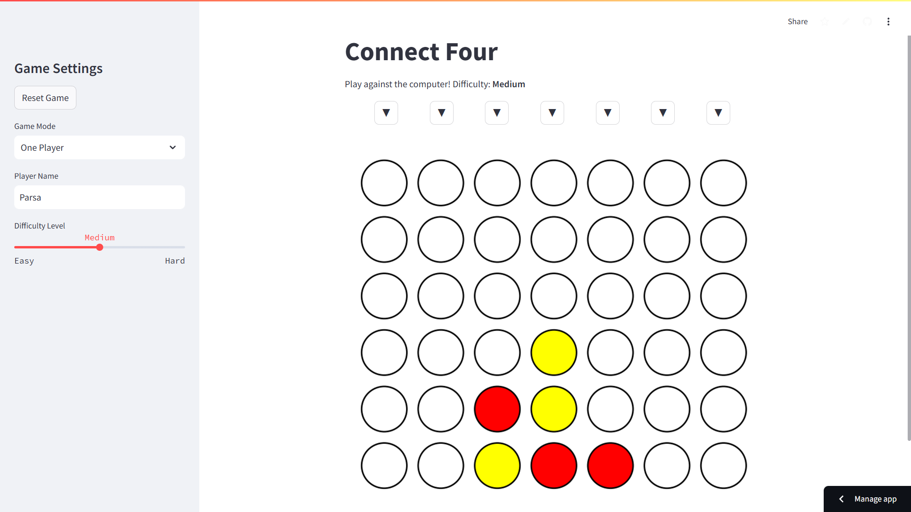

# Connect Four with AI 🎮
 
An interactive **Connect Four** game featuring an AI opponent with adjustable difficulty levels. Test your strategy skills against the computer or play with a friend!

Check out the game here: https://connectfour.streamlit.app/

## Key Features
- 🧠 **AI-Powered Gameplay**: Challenge an **AI** opponent with three difficulty levels:
  - Easy: Perfect for beginners. (**AI** sees 2 steps ahead)
  - Medium: A balanced challenge. (**AI** sees 4 steps ahead)
  - Hard: For seasoned players. (**AI** sees 6 steps ahead)
- 🎮 **Game Modes**: 
  - One Player (vs **AI**)
  - Two Players (vs a friend)
  
## Overview

 


## Quick Start
1. Install dependencies:
   ```bash
   pip install -r requirements.txt
   ```
2. Run the app:
   ```bash
   streamlit run app.py
   ```
 
## Requirements
- Python 3.8 or higher
- Libraries: `streamlit==1.39`, `matplotlib==3.7.2`, `numpy==1.24.2`

--- 

Enjoy the game and see if you can beat the AI! 🏆